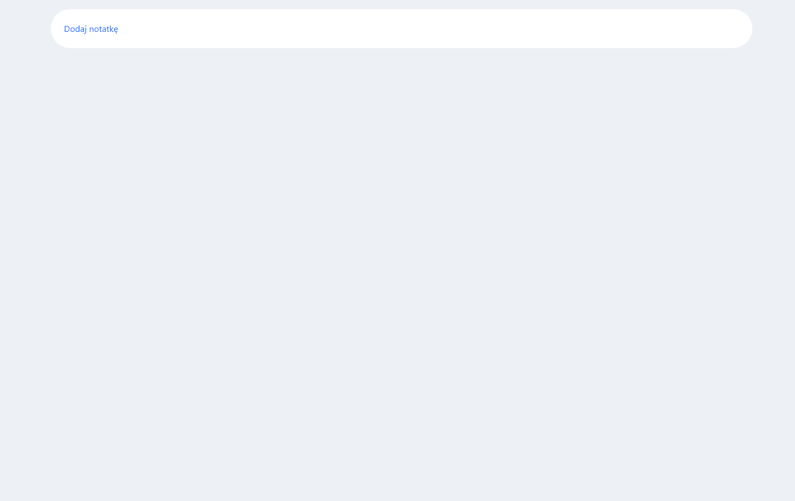
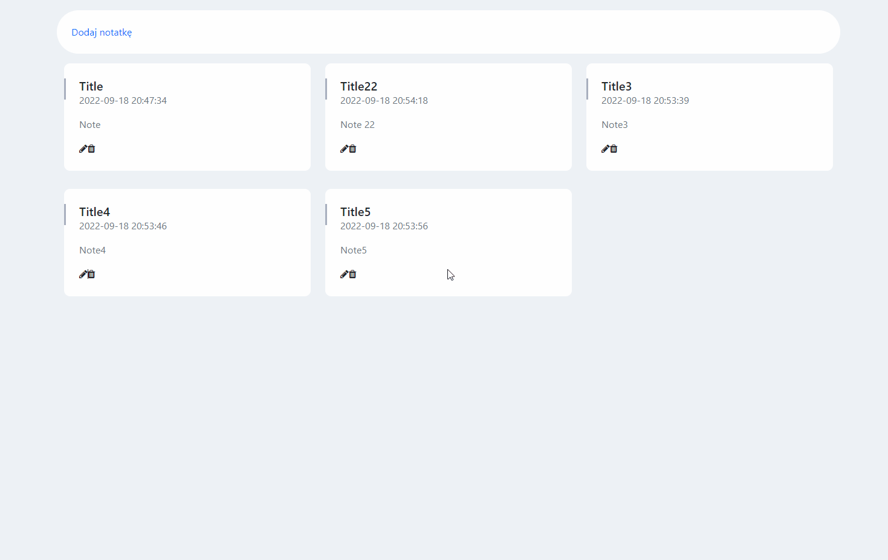

## About

The application for storing your personal notes in the database.

## Technologies

### Backend

- Spring Boot / Java
- Maven
- MySQL

### Frontend

- Angular

## How to run

### Backend

1. Set your MySQL database connection in ```SpringBackend\src\main\resources\application.properties``` file.
2. Run SpringBackendApplication class.

Default address of backend server is http://localhost:8080.

### Frontend

1. Use terminal from your root and go to Angular module with command: ```cd .\AngularFrontend\ ```.
2. Use command: ```ng serve``` to run the Angular module.

Default address of frontend server is  http://localhost:4200.

## Usage Example

Run http://localhost:4200/ in your browser.





Project was made for learning purposes.

Use freely.
